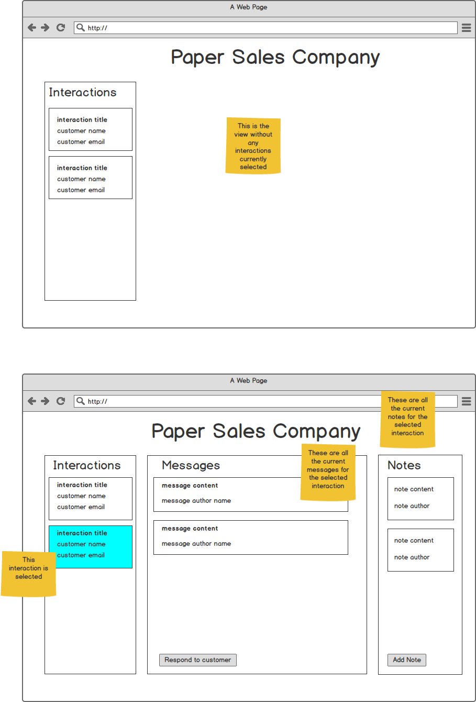

Paper Sales Company Customer Interaction App
============================================

The task for this homework assignment is to complete writing the web app for *Paper Sales Company*. This web app will
allow PSC sales agents to complete interactions with their customers.

The way that PSC represents their customer communications is through abstract models. The models they use are:
* *Customer*:  A customer represents a PSC customer. The model holds the name and email of the customer
* *Agent*: This represents one of the company's sales agent. This model holds the name and email of the agent.
* *Message*: A single, unidirectional message either from an agent to a customer, or from a customer to an agent. It holds a message id, the type of message (either the string "customer_message" or "agent_message"), the content of the message and an agentId, if the message author is one of the agents.
* *Interactions*:  An interaction between a customer and one or many agents. They contain:
  * A customerId, which references which customer this interaction belongs to
  * A collection of messages
  * A collection of notes
* *Note*: It represents a note about the interaction they belong to. A note contains content and the id of the agent who authored the note.

You are provided with the express server api in [server.js](server.js) to access the model. Within this server, you will find the dictionary variable `data` which contains the current state of the app. Be sure to inspect it and see how it implements the models described above. It also provides basic endpoints to retrieve and set some of the app state.
Your task is to consume the API provided on [server.js](server.js) to implement this frontend.

The requirements are:
* Write the frontend application using a Javascript framework, preferably React.
* You must consume the API provided by the server on `server.js`
* Make sure that the buttons "Respond to customer" and "Add Note" are functional. If there are missing endpoints on `server.js` to provide that functionality, you must implement them.
* The deliverable must be runnable using node stable. Preferably with a docker image to ensure portability.
* Together with the code, provide another README.md-style file (call it SOLUTION.md), where you outline the approach you took with your implementation and instructions on how to run your program. Your submission should be submitted to this repository, feel free to create the subdirectories that you need.
* If you have any questions, feel free to make assumptions about what you think is the best decision and state them on your SOLUTION.md file.
* Make sure to have fun while working on this! :)

